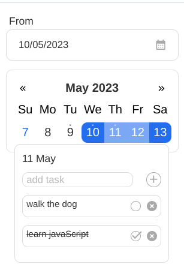
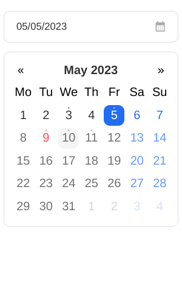

# Date picker

Simple library with date picker and range picker components.
[Explore on storybook](https://calendar-8repo8mbe-deborodina.vercel.app/?path=/story/date-picker--primary)

# View




## Instalation

```
npm i react-typescript-date-picker
```

## Provided components

```
<DatePicker/>
<RangePicker/>
```

## Common Props

```
 type?: 'day' | 'week' | 'month';
 weekStart?: 1 | 0; // 1-Monday 2-Sunday
 showWeekends?: boolean;
 holidays?: Date[];
 minDate?: Date;
 maxDate?: Date;
 withToDoList?: boolean;
 label?: string;
 mainColor?: string;
 holidayColor?: string;
 errorColor?: string;
 size?: 'small' | 'medium' | 'large';
```

## Date Picker Props

```
  defaultValue?: Date;
  onChange: (value: Date) => void;
```

## Range Picker Props

```
  defaultStartDate?: Date;
  defaultEndDate?: Date;
  onChange: (date: { startDate: Date; endDate: Date }) => void;
```
